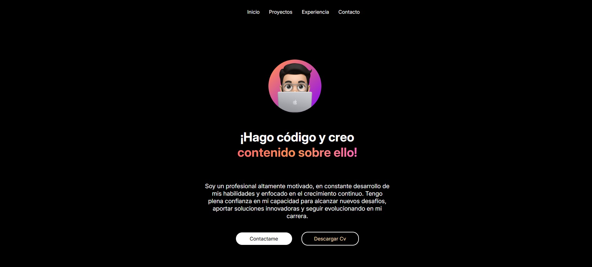

# Portafolio Web - Richard



Bienvenido a mi portafolio web. Este proyecto es una muestra de mis habilidades y experiencia en desarrollo web.

## Características
- Diseño moderno y responsive
- Secciones para proyectos, experiencia y contacto
- Implementado con Astro, TypeScript y React
- Personalizable con facilidad

## Tecnologías Utilizadas
- **Astro**: Framework para generar sitios web estáticos y rápidos

## Instalación y Uso
### Requisitos
- Node.js 18+
- npm o npx 

### Pasos
1. Clonar el repositorio:
   ```bash
   git clone https://github.com/richardcastiblancoo/portafolio.git
   cd portafolio-web-cv
   ```
2. Instalar dependencias:
   ```bash
   npm install
   ```
3. Ejecutar en modo desarrollo:
   ```bash
   npm run dev
   ```
4. Abrir en el navegador: `http://localhost:4321`

## Estructura del Proyecto
```
portafolio-web-cv/
│-- public/          # Recursos estáticos como imágenes y fuentes
│-- src/
│   │-- components/  # Componentes reutilizables de React
│   │-- layouts/     # Plantillas de diseño de las páginas
│   │-- pages/       # Páginas principales del portafolio
│   │-- styles/      # Archivos de estilos CSS/SCSS
│-- astro.config.mjs # Configuración de Astro
│-- package.json     # Dependencias y scripts del proyecto
│-- README.md        # Documentación del proyecto
```

## Personalización
Puedes cambiar el logo, colores y contenido en los archivos dentro de `src/`.

## Despliegue
Para subirlo a producción, usa:
```bash
npm run build
```
Luego, puedes desplegarlo en plataformas como Vercel o Netlify.

## Contacto
Si deseas contactarme, visita la sección de contacto en el portafolio o envíame un correo a [Richardcastiblanco@gmail.com](mailto:Richardcastiblanco@gmail.com).

¡Gracias por visitar mi portafolio! 🚀


